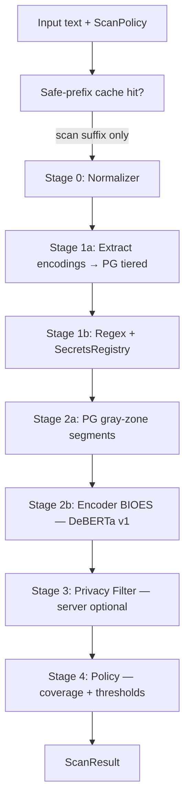

# Unplug Span Pipeline — Frozen Spec (v0.3 ML)

**Status:** Approved for implementation planning  
**Date:** 2026-05-21  
**Scope:** Runtime enforcement architecture (SDK + server). Dataset/training details reference `unplug-safeguard-data.md` (TBD). Experiments live in private repo `unplug_exp`.

---

## Goals

1. **Span-level redaction** for semantic threats (not chat-model “safety scores”).
2. **Deterministic first** (normalize, regex, registry); **ML second** (encoder BIOES, Prompt Guard on extracted encodings, Privacy Filter on server).
3. **Document-level BLOCK** when flagged span coverage exceeds a **user-configurable ratio** (default TBD; example 0.2).
4. **Incremental scan** via safe-prefix caching for append-only / RAG workloads.
5. **Forward-compatible session infra** (`session_id`, `agent_id`, `turn_id`) without multi-turn model in v1.

---

## ML deployment (product decision)

| Layer | Where models run | v1 |
|-------|------------------|-----|
| Regex + normalizer | SDK (local) | Yes |
| Encoder classifier (DeBERTa / custom) | **unplug-server only** | Yes — `Guard(mode="server")` |
| Privacy Filter | **Server only** | Yes |
| ONNX / local inference | SDK | **No** until BYOM phase |
| User-provided on-device model | SDK plugin | **Later** — custom model hook |

**Eval note:** `unplug_exp` DeBERTa benchmarks inform **server** model choice, not an SDK bundle.

---

## Non-goals (v1)

- **Local ML in the pip package** (no transformers/onnxruntime required for default install).
- Generative SLM (Gemma/LFM) as primary redaction engine.
- Training span models on pure encoding tricks (Base64, leet, etc.) — handled by normalize + Prompt Guard.
- Mandatory scan of all `retrieved` content — **callers choose** `source` and `scanners`.
- Session-level / crescendo classifier (infra only).

---

## Pipeline order



| Stage | Component | Output |
|-------|-----------|--------|
| 0 | `Normalizer` (12 stages incl. base64 decode inline) | `NormalizeResult` + `offset_table` |
| 1a | **Encoding extractor** → decoded payload → **Prompt Guard** | Mask **original encoding blob** on hit (no BIOES on blob) |
| 1b | Regex safeguards, `SecretsRegistry` | `Finding` spans |
| 2a | Prompt Guard 22M → 86M confirm on gray-zone | Block/mask segment or escalate |
| 2b | **DeBERTa-v3-small** (+ BIOES head), sliding 512 if needed | `Finding` spans on prose |
| 3 | **openai/privacy-filter** (server, optional extra) | PF spans → mapped to `Finding` |
| 4 | `ScanPolicy` | `ALLOW` \| `REDACT` \| `REVIEW` \| `BLOCK` |

Fail-closed: stage errors → `BLOCK` (existing pipeline behavior).

---

## Stage 1a — Encodings (Base64 and future decoders)

### Extract → classify → mask container

1. **Extract** encoding blobs from **original** text (regex/heuristics; today Base64 per `normalize._decode_base64` pattern).
2. **Decode** payload (UTF-8; invalid decode → treat blob as suspicious, mask container).
3. Run **Prompt Guard 22M** on decoded string (split if &gt;512 tokens; **any window malicious → blob malicious**).
4. If 22M uncertain → **Prompt Guard 86M** on same payload.
5. On malicious: emit single `Finding` on **original blob span** `[blob_start, blob_end)`, `subcategory=encoded_payload`, apply replacement `[REDACTED]`.
6. **Do not** run encoder BIOES inside that blob for v1.

### Supported encodings (v1 / roadmap)

| Encoding | v1 | Notes |
|----------|----|-------|
| Base64 | Yes | Inline decode already in normalizer |
| Base32 / Base85 | Later | Same extract→PG→mask pattern |
| Hex blobs | Later | Optional PG on decoded bytes as text |

### Training data

- Do **not** label encoding blobs for BIOES training.
- Eval set may include encoding attacks to verify PG + mask path.

---

## Stage 2b — Encoder token classification (injection / semantic)

### v1 model

- **Backbone:** `microsoft/deberta-v3-small` or ProtectAI-compatible small checkpoint.
- **Head:** token classification, **BIOES** labels aligned to Unplug `category` / `subcategory` taxonomy.
- **Input:** normalized text (prose regions excluding PG-masked blobs).
- **Spans:** map token spans → original via `NormalizeResult.to_original_span()`.
- **Long text:** sliding windows (512 tokens, overlap 64), merge overlapping findings.

### v2 evaluation path (not blocking v1)

- **ModernBERT-base** (8192 context) if long-doc eval shows boundary failures on DeBERTa windows.
- Switch criteria: span F1 gain on held-out long docs + cost/latency budget on server.

### What not to use for span redaction

- Chat-style Gemma/LFM “SAFE/UNSAFE” or numeric scores.
- Prompt Guard as sole semantic layer for prose (binary only).

---

## Stage 3 — Privacy Filter (server)

- Model: [openai/privacy-filter](https://huggingface.co/openai/privacy-filter) (Apache 2.0).
- Runs **server-side** optional dependency (`unplug[privacy]` or server bundle).
- Maps PF labels (`secret`, `private_email`, …) → `Finding` with spans.
- **Same coverage policy as other findings** — no special-case bypass (see Policy).

---

## Stage 4 — Policy (`ScanPolicy`)

### Span-level confidence

Existing `ThresholdConfig`:

| Threshold | Default | Effect |
|-----------|---------|--------|
| `review` | 0.3 | `REVIEW` |
| `redact` | 0.5 | Span eligible for redaction |
| `block` | 0.8 | High-confidence span (optional per-span block) |

### Document-level coverage (primary BLOCK gate)

```text
coverage = union_length(flagged_spans) / len(original_text)
```

- `flagged_spans`: findings with `score >= redact_threshold` (configurable).
- Merge overlapping/adjacent spans before measuring.
- If `coverage >= block_coverage_ratio` → **`action = BLOCK`** (no usable body / agent message).
- Else if any redact-eligible findings → **`REDACT`** with `redacted_text`.
- Else → **`ALLOW`**.

### `ScanPolicy` fields (API + `GuardConfig`)

```python
class ScanPolicy(BaseModel):
    block_coverage_ratio: float = 0.2  # default; user override per request
    redact_threshold: float = 0.5
    review_threshold: float = 0.3
    block_threshold: float = 0.8  # per-span high confidence
    merge_overlapping_spans: bool = True
    # Future: per-category coverage overrides
    # category_block_coverage: dict[str, float] = {}
```

**Important:** Secrets/PII findings use the **same** `block_coverage_ratio` unless the user sets category-specific overrides later. Small secret span in a long doc → **redact** only; BLOCK when cumulative flagged coverage exceeds ratio.

### Prompt Guard two-tier

| Tier | Model | When |
|------|-------|------|
| 1 | Llama-Prompt-Guard-2-22M | Every decoded encoding payload; gray-zone segments |
| 2 | Llama-Prompt-Guard-2-86M | Tier-1 “malicious” or low-margin |

Skip PG when regex match has `score >= scanner.base_score` (high confidence).

---

## Caching

### Safe-prefix cache

- Key: `(document_id | content_hash, normalizer_version, model_version)`.
- Value: `safe_prefix_len` — bytes/chars verified clean after last scan.
- On append-only input: run pipeline **only** on `text[safe_prefix_len:]`, offset-findings by `safe_prefix_len`.
- Advance prefix only when suffix result is `ALLOW` or `REDACT` with no BLOCK (product rule: configurable).

### Chunk cache

- Key: `hash(normalized_chunk_text)`.
- Value: prior `ScanResult` summary.
- Invalidate on normalizer or model version bump.

### Storage

| Deployment | Backend |
|------------|---------|
| SDK in-process | LRU per `session_id` |
| Server | Redis / Postgres (later) |

---

## Session infra (v1 hooks, v2 model)

### Request fields

```json
{
  "text": "...",
  "source": "user",
  "scanners": null,
  "redact": true,
  "session_id": "optional",
  "agent_id": "optional",
  "turn_id": 1,
  "document_id": "optional-rag-chunk",
  "block_coverage_ratio": 0.2
}
```

### `ExecutionContext` extensions

- `agent_id: str | None`
- `turn_id: int | None`
- `document_id: str | None`
- `scan_cache: ScanCache | None` (safe prefix + chunk LRU)

### Deferred

- `scan_mode: "turn" | "session"` — concatenate last N turns for one forward pass.
- Crescendo / many-shot training.

---

## Caller control (`source` / scanners)

Unplug does **not** force scanning all retrieved content.

| Preset (docs only) | Typical `source` | Scanners |
|--------------------|------------------|----------|
| `user_input` | `user` | injection, limits |
| `rag_chunk` | `retrieved` | injection, leakage (if server PF enabled) |
| `tool_output` | `tool_output` | injection, destructive |
| `full` | any | all enabled |

Integrators pass `scanners: ["injection"]` etc. per call site.

---

## OWASP mapping (runtime)

| OWASP | Stage |
|-------|-------|
| LLM01 Prompt injection | 1a PG encodings + 2b BIOES + regex |
| LLM02 Sensitive disclosure | 1b regex + 3 PF |
| LLM06 Excessive agency | Tool pipeline (separate spec) + destructive regex/model |
| LLM07 System prompt leakage | leakage regex + PF |
| LLM10 Unbounded consumption | `LimitConfig` (wire separately) |

---

## Implementation phases

| Phase | Work | Repo |
|-------|------|------|
| **P0** | Spec + eval harness design | `jakarta` + `unplug_exp` |
| **P1** | Eval on public datasets (no train) | `unplug_exp` |
| **P2** | Encoding extractor + PG path + coverage policy in SDK | `jakarta` |
| **P3** | DeBERTa BIOES training + server deploy | `unplug_exp` → artifacts → `unplug-server` |
| **P4** | PF server integration + cache | `jakarta` / server |

---

## Related docs

- `.context/research/owasp-llm-top10.md`
- `.context/research/openai-privacy-filter.md`
- `.context/research/models-and-datasets.md`
- `context/product/plans/unplug-exp-repo.md`
- API: `.context/research/api-contract.md` (extend with `ScanPolicy` fields)

---

## Open parameters (decide before eval baselines)

| Parameter | Default proposal | Notes |
|-----------|------------------|-------|
| `block_coverage_ratio` | `0.2` | User/API override |
| PG on prose | gray-zone + `retrieved`/`tool_output` optional preset | Not global mandatory |
| DeBERTa window | 512 / overlap 64 | Until ModernBERT eval |
| Cache advance on REDACT | yes, with redacted canonical suffix | Avoid re-scanning redacted bytes |
